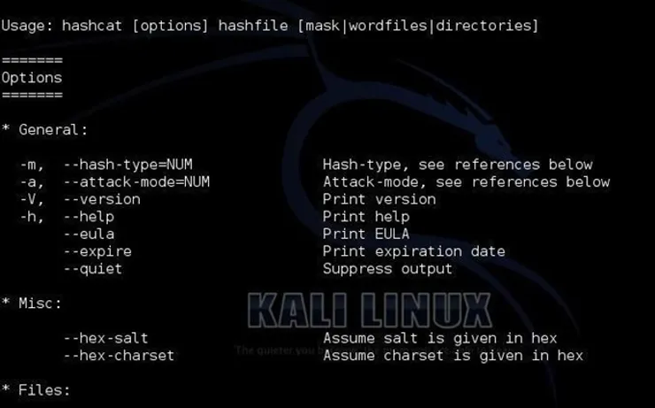

# [Brute force](https://www.cnil.fr/fr/definition/force-brute-attaque-informatique)

L'attaque par force brute est une méthode utilisée en cryptanalyse pour trouver un mot de passe ou une clé. Il s'agit de tester, une à une, toutes les combinaisons possibles.

Lorsque l'on se retrouve dans l'impossibilité de contourner les différentes parties et script d'une application, on a besoin le trouver un mots de passe ou une clé. Par exemple avec le Json Web Token, la clé privée étant stocker côté serveur, les seules moyen de parvenir à obtenir la clé pour décoder les information du Token, soit introduire le serveur et récupérer la clef, soit dans l'impossibilité, brut forcé la clef, c'est à déencoder cette dernière et la comparer à plein d'autres clefs elle-même aussi encode avec le même algorythme.

# Parts 

- [Ressources](#ressources)

# <a id="ressources"> Ressources 

- []
