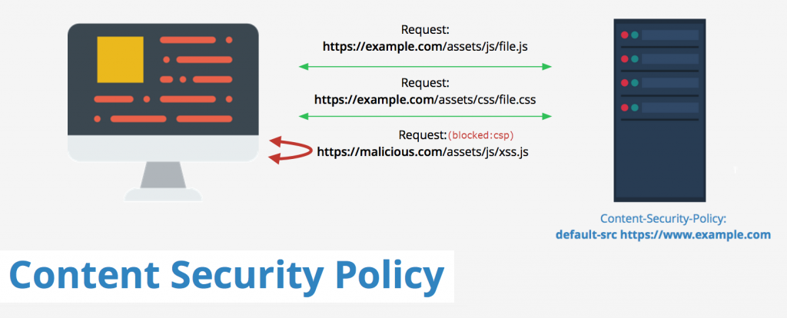

# [Content Sécurity Policy (CSP) Bypass](https://medium.com/@bhaveshthakur2015/content-security-policy-csp-bypass-techniques-e3fa475bfe5d#:~:text=If%20the%20application%20is%20using,callback%20functions%20and%20vulnerable%20class.)

# Parts

-[Exercice 1 : CSP Bypass Inline Code]()

## Ressources 

[Content Security Policy Definition](https://fr.wikipedia.org/wiki/Content_Security_Policy)

[Content Security Bypass (Deteact Blog)](https://blog.deteact.com/csp-bypass/)

[Example Passbin](https://pastebin.com/raw/325DfBSc)

[Example Hastebin](https://hastebin.com/raw/utolejavef)

[RequestBin](https://requestbin.com/)

[CSP Bypass techniques](https://bhavesh-thakur.medium.com/content-security-policy-csp-bypass-techniques-e3fa475bfe5d)

