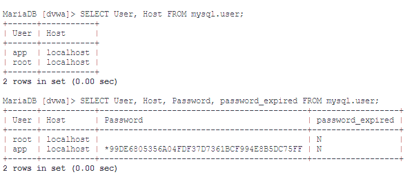
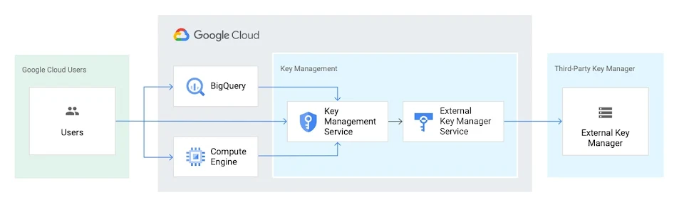

# Cyber X Security

## Ressources

- [Lien du package DVWA Image Docker](https://hub.docker.com/r/vulnerables/web-dvwa)
- []()
- []()
- []()
- []()


## Install on Docker

```bash
docker pull cyberxsecurity/dvwa
```

Démarrage d'un docker dvwa 
Name : dvwa1
Port : 81

```bash
docker container run -d --name=dvwa1 -p 81:80 cyberxsecurity/dvwa
```

Aller dans le docker > View details > Terminal
Pour voir les différents utilisateurs, et leurs mots de passe

Connection à la base MySQL [dvwa]
```bash
mysql -u root
```
Ouverture de la session : `MariaDB [dvwa] > `

Voir les utilisateurs et leurs mots de passe

```bash
SELECT User, Host, Password, password_expired FROM mysql.user;
```


Ici on peut lire un mot de passe encrypté : `*99DE6805356A04FDF37D7361BCF994E8B5DC75FF`

## Trouver et décrypter le mot de passe

[**Ressources d'instruction**](assets/dvwa_html/Instructions%20__%20Damn%20Vulnerable%20Web%20Application%20(DVWA)%20v1.10%20_Development_.html)
[**A propos DVWA**](assets/dvwa_html/About%20__%20Damn%20Vulnerable%20Web%20Application%20(DVWA)%20v1.10%20_Development_.html)

**Si vous avec effectuée des modification ou autre erreur, simple, réinstaller la librairie et relancer le docker** Repasser la l'étape d'installation

La génération par DVWA de la base :

```mysql
mysql> create database dvwa;
Query OK, 1 row affected (0.00 sec)

mysql> create user dvwa@localhost identified by 'p@ssw0rd';
Query OK, 0 rows affected (0.01 sec)

mysql> grant all on dvwa.* to dvwa@localhost;
Query OK, 0 rows affected (0.01 sec)

mysql> flush privileges;
Query OK, 0 rows affected (0.00 sec)
```

Bon l'authentification lors de la première installation automatique de la base de donnée MariaDB de DVWA est :
```php
$_DVWA[ 'db_user' ] = 'dvwa';
$_DVWA[ 'db_password' ] = 'p@ssw0rd';
$_DVWA[ 'db_database' ] = 'dvwa';
```
Les identifiants de connection par défault de l'app sont :
``` JSON
first_login : {
    "my_dock_url" : "http://localhost:82", 
    "url_instruction" : "assets/dvwa_html/Instructions __ Damn Vulnerable Web Application (DVWA) v1.10 _Development_.html",
    "id" : "admin",
    "password" : "password" 
}
```


### Ressources
Chez IBM 
- [IBN Codage et chiffrement des mots de passe](https://www.ibm.com/docs/fr/was/9.0.5?topic=files-password-encoding-encryption)
- [IBN Conseil de résolution des incidents liés au décodage du mot de passe de sécurité](https://www.ibm.com/docs/fr/was/9.0.5?topic=configurations-password-decoding-troubleshooting-tips-security)


Chez Google

Le mode d'encryption/decryption de Google Cloud KMS, Cloud KMS est une API REST qui peut utiliser une clé pour chiffrer, déchiffrer ou signer des données, comme des secrets, à des fins de stockage.
- [Présentation du système Security Key Managment](https://cloud.google.com/security-key-management?hl=fr#:~:text=Cloud%20KMS%20est%20une%20API,%C3%A0%20des%20fins%20de%20stockage.)
- [Page général de la documentation de Google KMS(KeyManagmentSecurity)](https://cloud.google.com/kms/docs/apis?hl=fr)
- [Créer un clé de signature Cloud KMS](https://cloud.google.com/kms/docs/reference/pkcs11-apache?hl=fr#creating_a-hosted_signing_key)


Google HSM
Cloud HSM est un service de module de sécurité matériel sur le cloud qui permet d'héberger des clés de chiffrement et d'effectuer des opérations de chiffrement dans un cluster de modules HSM certifiés FIPS 140-2 niveau 3. Google gère le cluster HSM à votre place. Vous n'avez donc pas à vous soucier du clustering, du scaling ni des correctifs. Comme Cloud HSM utilise Cloud KMS comme interface, vous pouvez exploiter toutes les commodités et fonctionnalités offertes par Cloud KMS.
- [Créer des trousseaux de clés](https://cloud.google.com/kms/docs/hsm?hl=fr#create_a_key_ring)
Google CLI 
```bash
gcloud kms keyrings create KEY_RINGS \ --location my/super/cloud/protected/location/path/exemple
```

### Decryptage du password de l'application

Rendez-vous sur votre navigateur et saisez l'addresse localhost de votre docker
Ex : `http://localhost:81` Si votre docker tourne le port http(80) sous-port 81 de votre carte réseau

Vous devriez avoir une page de connection. Comme la base de donnée MariaDB de DVWA n'est pas encore configurée, les identifiants et mots de passe seront par défaut vide, cliquez simplement sur **Se connecter**
Puis l'interface de configuration de la librairie apparai tel que [Interface de settup HTML](assets/dvwa_html/Setup%20__%20Damn%20Vulnerable%20Web%20Application%20(DVWA)%20v1.10%20_Development_.html)


## X-XSS Failures - Fishing

Utilies :

- [URL Encode/Decode](https://www.url-encode-decode.com/)

Formulaire test login d'integration lors d'une faille XSS trouvée

Attention à remplacer l'url avec l'encodage via Url Encode/Decode

```html

<!-- Suppression de tout les autres éléments html -->
<style>* {overflow: hidden;}</style>

<!-- Ajout de nos nouveaux element html -->

<div>
    <form>
        <p>Login : <input type="text" name="login"></p>
        <p>Password: <input type="text" name="password"></p>
        <button type="submit" >Se connecter</button>
    </form>
</div>


```
## Rout ME - La plateforme de test de cos compétences en hacking

[Voir le site Root Me ](https://www.root-me.org/)

### Exercice 1 - XSS Cahllenge Stored 1
w
[Aller à l'exercice sur le site Root Me](https://www.root-me.org/fr/Challenges/Web-Client/XSS-Stockee-1?q=%2Ffr%2FChallenges%2FWeb-Client%2FXSS-Stored-1&lang=fr)