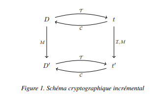

# Data Ecryption


L'encryption des données (fichiers ou autres) est l'une des parties les plus importantes dans le sécuritée. Elle permet de stocker votre fichier ou données sous un autre format uniquement déchiffrage par une ou plus clés (le plus souvant des chaines de caractères).

Il y a plusieur type et norme de cryptographie, les principales :

- Cryptographie Incrémentale : 


[**Voir la mise en oeuvre et documentation**](assets/EdA_cryptographie_incrementale_revision_mars_2019.pdf) de [HAL Science](https://hal.science/)
```maths
DÉFINITION 1. — Un système cryptographique incrémental est spécifié par un 4-
uplet Π = (G, T , C, I) d’algorithmes en temps polynomial :
– G est un algorithme probabiliste de génération de clés. Il prend en entrée un
paramètre de sécurité k (en unaire) et retourne une paire de clés (K0
, K00) où K0
est
la clé de transformation et K00 la clé conjuguée.
– T est un algorithme probabiliste de transformation. Il prend en entrées une clé
K0
et un document D ∈
P+
et retourne une forme cryptographique t = TK0 (D).
La Cryptographie incrémentale 7
– C est un algorithme déterministe effectuant l’opération de transformation inverse (conjuguée) de T . Il prend en entrées la clé conjuguée K00 et la forme cryptographique t et retourne D ou une erreur ⊥.
– I est un algorithme probabiliste effectuant la mise à jour incrémentale. Il prend
en entrées la clé K0
, (le document D,) la forme cryptographique t (associée à D), une
opération de mise à jour M ∈ M et retourne la forme cryptographique mise à jour t
0
.
Pour toute paire de clés (K0
, K00) retournée par G et pour tout document D,
nous avons CK00 (TK0 (D)) = D. De plus, pour toute paire de clés (K0
, K00) retournée par G, pour tout document D et pour toute modification M ∈ M, nous avons
CK00 (IK0 (D, TK0 (D), M)) = DhMi. Un système incrémental peut être illustré avec
le diagramme commutatif de la figure 1.
```

## Parts

1. Encryption Standards
2. La cryptograpgie asymétrique avec NodeJS


## Ressources

- [Encruption (Proof Point)](https://www.proofpoint.com/fr/threat-reference/encryption)

- [Logiciel de cryptage de fichier (Go Any Where)](https://www.goanywhere.com/fr/blog/logiciel-de-cryptage-de-fichiers)

- [NIST Transitioning the Use of Cryptographic Algorithms and Key Lengths (Rev 2)](https://csrc.nist.gov/publications/detail/sp/800-131a/rev-2/final)

- [Encryptage par défault chez Google (AES)](https://cloud.google.com/docs/security/encryption/default-encryption?hl=fr)

- [La cryptographie asymétrique avec NodeJS](https://mylittleneuron.com/2019/07/13/la-cryptographie-asymetrique-avec-nodejs/)


## 1. Encryption Standards
- - **Chiffrement AES** (Advanced Encryption Standard) : Est l'algorithme considéré comme la norme par le gouvernement américains et autres organimation. Bien qu'il soit extrêmement efficace sous forme de 128 bits, l'AES utilise également des clés de 192 et 256 bits pour le chiffrement à haut rendement.

L'AES est considéré comme résistant à toutes les attaques, à l'exception des attaques par force brute, qui tentent de déchiffrer les messages en utilisant toutes les combinaisons possibles dans le chiffrement de 128, 192 ou 256 bits. Néanmoins, les experts en sécurité estiment que l'AES finira par devenir la norme pour le chiffrement des données dans le secteur privé.

## 2. La cryptograpgie asymétrique avec NodeJS

[**LA cryptographie asymétrique** (Wikipédia)](https://fr.wikipedia.org/wiki/Cryptographie_asym%C3%A9trique)

Très bonne image pour comprendre le transfert et utilisation de clés (publique/privée) en méthodologie asynchrone.

[Wiki Image - Keys](assets/alice_bob_public_private_keys_works.png)