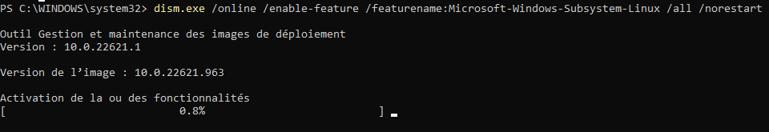
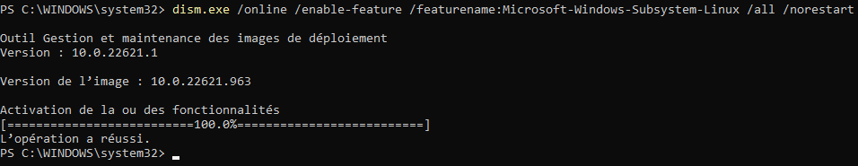

# Docker Desktop Install & Init

Rappel un port est une entrée sur la carte réseau d'accès à la machine

## Linux Kernel Update Package




- [Windows Tutorial Install](https://learn.microsoft.com/en-us/windows/wsl/install-manual)

Steps :


1. Open Power Shell at administrator and enter :
```PS
dism.exe /online /enable-feature /featurename:Microsoft-Windows-Subsystem-Linux /all /norestart


```


# Start Doker