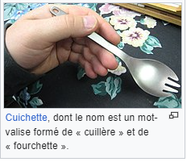

# File Encoding study

## Part of this subject

1. Les premiers encodages

## Ressources 

- [Tout savoir sur l'encodage (Dimensional Insight)](https://www.difrance.com/informations/tout-savoir-sur-l-encodage#:~:text=Ce%20sont%3A%20auto%2C%20ascii%2C,%2Dbe%2C%20unicode%2Dle.)
- 
- 
- 
- 

# 1. Les premiers encodages
 
## Le premier octect de 8bits 

### Rappel :

- [**Mot-valise**(traduction de l'anglais « portmanteau word »)](https://fr.wikipedia.org/wiki/Mot-valise) : Mot composé de morceaux non signifiants de deux ou plusieurs mots.

- [**1 Bits**](https://www.lemagit.fr/definition/Bit) : Mot-valise créé à partir de l'anglais binary digit, soit chiffre binaire, est la plus petite unité de donnée d'un ordinateur. **Un bit a une seule valeur binaire, 0 ou 1.**

- [**Système hexadécimal**]() : Le système hexadécimal est un système de numération positionnel en base 16. Il utilise ainsi 16 symboles, en général les chiffres arabes pour les dix premiers chiffres et les lettres A à F pour les six suivants.

1 Octect de 8bits comportait les lettres de l'alphabet latin et les majuscule.

A a, B b, C c, D d, E e, F f, G g, H h, I i, J j, K k, L l, M m, N n, O o, P p, Q q, R r, S s, T t, U u, V v, W w, X x, Y y, Z z.

### EBCDIC (Extended Binary Coded Decimal Interchange Code) par IBM

<table border="1" cellspacing="0" cellpadding="2" class="wikitable" style="margin:0 2em 0 0">
<caption>Jeu de caractères EBCDIC (variante compatible avec l’UTF-EBCDIC).
</caption>
<tbody><tr align="center">
<th scope="col" rowspan="2">Quartet haut
</th>
<th scope="col" colspan="16">Quartet bas (toutes les valeurs sont en <a href="/wiki/Syst%C3%A8me_hexad%C3%A9cimal" title="Système hexadécimal">hexadécimal</a>)
</th></tr>
<tr align="center">
<th scope="col">...0
</th>
<th scope="col">...1
</th>
<th scope="col">...2
</th>
<th scope="col">...3
</th>
<th scope="col">...4
</th>
<th scope="col">...5
</th>
<th scope="col">...6
</th>
<th scope="col">...7
</th>
<th scope="col">...8
</th>
<th scope="col">...9
</th>
<th scope="col">...A
</th>
<th scope="col">...B
</th>
<th scope="col">...C
</th>
<th scope="col">...D
</th>
<th scope="col">...E
</th>
<th scope="col">...F
</th></tr>
<tr align="center">
<th scope="row">0...
</th>
<td bgcolor="#FFCCCC"><small>NUL</small> <small>0000</small>
</td>
<td bgcolor="#FFCCCC"><small>SOH</small> <small>0001</small>
</td>
<td bgcolor="#FFCCCC"><small>STX</small> <small>0002</small>
</td>
<td bgcolor="#FFCCCC"><small>ETX</small> <small>0003</small>
</td>
<td bgcolor="#FFCCFF"><small>ST</small> <small>009C</small>
</td>
<td bgcolor="#FFCCCC"><small>HT</small> <small>0009</small>
</td>
<td bgcolor="#FFCCFF"><small>SSA</small> <small>0086</small>
</td>
<td bgcolor="#FFCCCC"><small>DEL</small> <small>007F</small>
</td>
<td bgcolor="#FFCCFF"><small>EPA</small> <small>0097</small>
</td>
<td bgcolor="#FFCCFF"><small>RI</small> <small>008D</small>
</td>
<td bgcolor="#FFCCFF"><small>SS2</small> <small>008E</small>
</td>
<td bgcolor="#FFCCCC"><small>VT</small> <small>000B</small>
</td>
<td bgcolor="#FFCCCC"><small>FF</small> <small>000C</small>
</td>
<td bgcolor="#FFCCCC"><small>CR</small> <small>000D</small>
</td>
<td bgcolor="#FFCCCC"><small>SO</small> <small>000E</small>
</td>
<td bgcolor="#FFCCCC"><small>SI</small> <small>000F</small>
</td></tr>
<tr align="center">
<th scope="row">1...
</th>
<td bgcolor="#FFCCCC"><small>DLE</small> <small>0010</small>
</td>
<td bgcolor="#FFCCCC"><small>DC1</small> <small>0011</small>
</td>
<td bgcolor="#FFCCCC"><small>DC2</small> <small>0012</small>
</td>
<td bgcolor="#FFCCCC"><small>DC3</small> <small>0013</small>
</td>
<td bgcolor="#FFCCFF"><small>OSC</small> <small>009D</small>
</td>
<td bgcolor="#FFCCCC"><small>LF</small> <small>000A</small>
</td>
<td bgcolor="#FFCCCC"><small>BS</small> <small>0008</small>
</td>
<td bgcolor="#FFCCFF"><small>ESA</small> <small>0087</small>
</td>
<td bgcolor="#FFCCCC"><small>CAN</small> <small>0018</small>
</td>
<td bgcolor="#FFCCCC"><small>EM</small> <small>0019</small>
</td>
<td bgcolor="#FFCCFF"><small>PU2</small> <small>0092</small>
</td>
<td bgcolor="#FFCCFF"><small>SS3</small> <small>008F</small>
</td>
<td bgcolor="#FFCCCC"><small>FS</small> <small>001C</small>
</td>
<td bgcolor="#FFCCCC"><small>GS</small> <small>001D</small>
</td>
<td bgcolor="#FFCCCC"><small>RS</small> <small>001E</small>
</td>
<td bgcolor="#FFCCCC"><small>US</small> <small>001F</small>
</td></tr>
<tr align="center">
<th scope="row">2...
</th>
<td bgcolor="#FFCCFF"><small>PAD</small> <small>0080</small>
</td>
<td bgcolor="#FFCCFF"><small>HOP</small> <small>0081</small>
</td>
<td bgcolor="#FFCCFF"><small>BPH</small> <small>0082</small>
</td>
<td bgcolor="#FFCCFF"><small>NBH</small> <small>0083</small>
</td>
<td bgcolor="#FFCCFF"><small>IND</small> <small>0084</small>
</td>
<td bgcolor="#FFCCFF"><small>NEL</small> <small>0085</small>
</td>
<td bgcolor="#FFCCCC"><small>ETB</small> <small>0017</small>
</td>
<td bgcolor="#FFCCCC"><small>ESC</small> <small>001B</small>
</td>
<td bgcolor="#FFCCFF"><small>HTS</small> <small>0088</small>
</td>
<td bgcolor="#FFCCFF"><small>HTJ</small> <small>0089</small>
</td>
<td bgcolor="#FFCCFF"><small>VTS</small> <small>008A</small>
</td>
<td bgcolor="#FFCCFF"><small>PLD</small> <small>008B</small>
</td>
<td bgcolor="#FFCCFF"><small>PLU</small> <small>008C</small>
</td>
<td bgcolor="#FFCCCC"><small>ENQ</small> <small>0005</small>
</td>
<td bgcolor="#FFCCCC"><small>ACK</small> <small>0006</small>
</td>
<td bgcolor="#FFCCCC"><small>BEL</small> <small>0007</small>
</td></tr>
<tr align="center">
<th scope="row">3...
</th>
<td bgcolor="#FFCCFF"><small>DCS</small> <small>0090</small>
</td>
<td bgcolor="#FFCCFF"><small>PU1</small> <small>0091</small>
</td>
<td bgcolor="#FFCCCC"><small>SYN</small> <small>0016</small>
</td>
<td bgcolor="#FFCCFF"><small>STS</small> <small>0093</small>
</td>
<td bgcolor="#FFCCFF"><small>CCH</small> <small>0094</small>
</td>
<td bgcolor="#FFCCFF"><small>MW</small> <small>0095</small>
</td>
<td bgcolor="#FFCCFF"><small>SPA</small> <small>0096</small>
</td>
<td bgcolor="#FFCCCC"><small>EOT</small> <small>0004</small>
</td>
<td bgcolor="#FFCCFF"><small>SOS</small> <small>0098</small>
</td>
<td bgcolor="#FFCCFF"><small>SGCI</small> <small>0099</small>
</td>
<td bgcolor="#FFCCFF"><small>SCI</small> <small>009A</small>
</td>
<td bgcolor="#FFCCFF"><small>CSI</small> <small>009B</small>
</td>
<td bgcolor="#FFCCCC"><small>DC4</small> <small>0014</small>
</td>
<td bgcolor="#FFCCCC"><small>NAK</small> <small>0015</small>
</td>
<td bgcolor="#FFCCFF"><small>PM</small> <small>009E</small>
</td>
<td bgcolor="#FFCCCC"><small>SUB</small> <small>001A</small>
</td></tr>
<tr align="center">
<th scope="row">4...
</th>
<td bgcolor="#FFFFFF"><small>SP</small> <small>0020</small>
</td>
<td bgcolor="#CCFFCC"><small>NBSP</small> <small><i>00A0</i></small>
</td>
<td bgcolor="#CCFFCC">¡ <small><i>00A1</i></small>
</td>
<td bgcolor="#CCFFCC">¢ <small><i>00A2</i></small>
</td>
<td bgcolor="#CCFFCC">£ <small><i>00A3</i></small>
</td>
<td bgcolor="#CCFFCC">¤ <small><i>00A4</i></small>
</td>
<td bgcolor="#CCFFCC">¥ <small><i>00A5</i></small>
</td>
<td bgcolor="#CCFFCC">¦ <small><i>00A6</i></small>
</td>
<td bgcolor="#CCFFCC">§ <small><i>00A7</i></small>
</td>
<td bgcolor="#CCFFCC">¨ <small><i>00A8</i></small>
</td>
<td bgcolor="#CCFFCC">© <small><i>00A9</i></small>
</td>
<td bgcolor="#FFFFFF">. <small>002E</small>
</td>
<td bgcolor="#FFFFFF">&lt; <small>003C</small>
</td>
<td bgcolor="#FFFFFF">( <small>0028</small>
</td>
<td bgcolor="#FFFFFF">+ <small>002B</small>
</td>
<td bgcolor="#FFFFCC">| <small><i>007C</i></small>
</td></tr>
<tr align="center">
<th scope="row">5...
</th>
<td bgcolor="#FFFFFF">&amp; <small>0026</small>
</td>
<td bgcolor="#CCFFCC">ª <small><i>00AA</i></small>
</td>
<td bgcolor="#CCFFCC">« <small><i>00AB</i></small>
</td>
<td bgcolor="#CCFFCC">¬ <small><i>00AC</i></small>
</td>
<td bgcolor="#CCFFCC"><small>SHY</small> <small><i>00AD</i></small>
</td>
<td bgcolor="#CCFFCC">® <small><i>00AE</i></small>
</td>
<td bgcolor="#CCFFCC">¯ <small><i>00AF</i></small>
</td>
<td bgcolor="#CCFFCC">° <small><i>00B0</i></small>
</td>
<td bgcolor="#CCFFCC">± <small><i>00B1</i></small>
</td>
<td bgcolor="#CCFFCC">² <small><i>00B2</i></small>
</td>
<td bgcolor="#FFFFCC">! <small><i>0021</i></small>
</td>
<td bgcolor="#FFFFCC">$ <small><i>0024</i></small>
</td>
<td bgcolor="#FFFFFF">* <small>002A</small>
</td>
<td bgcolor="#FFFFFF">) <small>0029</small>
</td>
<td bgcolor="#FFFFFF">; <small>003B</small>
</td>
<td bgcolor="#FFFFCC">^ <small><i>005E</i></small>
</td></tr>
<tr align="center">
<th scope="row">6...
</th>
<td bgcolor="#FFFFFF">- <small>002D</small>
</td>
<td bgcolor="#FFFFFF">/ <small>002F</small>
</td>
<td bgcolor="#CCFFCC">³ <small><i>00B3</i></small>
</td>
<td bgcolor="#CCFFCC">´ <small><i>00B4</i></small>
</td>
<td bgcolor="#CCFFCC">µ <small><i>00B5</i></small>
</td>
<td bgcolor="#CCFFCC">¶ <small><i>00B6</i></small>
</td>
<td bgcolor="#CCFFCC">· <small><i>00B7</i></small>
</td>
<td bgcolor="#CCFFCC">¸ <small><i>00B8</i></small>
</td>
<td bgcolor="#CCFFCC">¹ <small><i>00B9</i></small>
</td>
<td bgcolor="#CCFFCC">º <small><i>00BA</i></small>
</td>
<td bgcolor="#CCFFCC">» <small><i>00BB</i></small>
</td>
<td bgcolor="#FFFFFF">, <small>002C</small>
</td>
<td bgcolor="#FFFFFF">% <small>0025</small>
</td>
<td bgcolor="#FFFFFF">_ <small>005F</small>
</td>
<td bgcolor="#FFFFFF">&gt; <small>003E</small>
</td>
<td bgcolor="#FFFFFF">? <small>003F</small>
</td></tr>
<tr align="center">
<th scope="row">7...
</th>
<td bgcolor="#CCFFCC">¼ <small><i>00BC</i></small>
</td>
<td bgcolor="#CCFFCC">½ <small><i>00BD</i></small>
</td>
<td bgcolor="#CCFFCC">¾ <small><i>00BE</i></small>
</td>
<td bgcolor="#CCFFCC">¿ <small><i>00BF</i></small>
</td>
<td bgcolor="#CCFFCC">À <small><i>00C0</i></small>
</td>
<td bgcolor="#CCFFCC">Á <small><i>00C1</i></small>
</td>
<td bgcolor="#CCFFCC">Â <small><i>00C2</i></small>
</td>
<td bgcolor="#CCFFCC">Ã <small><i>00C3</i></small>
</td>
<td bgcolor="#CCFFCC">Ä <small><i>00C4</i></small>
</td>
<td bgcolor="#FFFFCC">` <small><i>0060</i></small>
</td>
<td bgcolor="#FFFFFF">: <small>003A</small>
</td>
<td bgcolor="#FFFFCC"># <small><i>0023</i></small>
</td>
<td bgcolor="#FFFFCC">@ <small><i>0040</i></small>
</td>
<td bgcolor="#FFFFFF">' <small>0027</small>
</td>
<td bgcolor="#FFFFFF">= <small>003D</small>
</td>
<td bgcolor="#FFFFCC">" <small><i>0022</i></small>
</td></tr>
<tr align="center">
<th scope="row">8...
</th>
<td bgcolor="#CCFFCC">Å <small><i>00C5</i></small>
</td>
<td bgcolor="#FFFFFF">a <small>0061</small>
</td>
<td bgcolor="#FFFFFF">b <small>0062</small>
</td>
<td bgcolor="#FFFFFF">c <small>0063</small>
</td>
<td bgcolor="#FFFFFF">d <small>0064</small>
</td>
<td bgcolor="#FFFFFF">e <small>0065</small>
</td>
<td bgcolor="#FFFFFF">f <small>0066</small>
</td>
<td bgcolor="#FFFFFF">g <small>0067</small>
</td>
<td bgcolor="#FFFFFF">h <small>0068</small>
</td>
<td bgcolor="#FFFFFF">i <small>0069</small>
</td>
<td bgcolor="#CCFFCC">Æ <small><i>00C6</i></small>
</td>
<td bgcolor="#CCFFCC">Ç <small><i>00C7</i></small>
</td>
<td bgcolor="#CCFFCC">È <small><i>00C8</i></small>
</td>
<td bgcolor="#CCFFCC">É <small><i>00C9</i></small>
</td>
<td bgcolor="#CCFFCC">Ê <small><i>00CA</i></small>
</td>
<td bgcolor="#CCFFCC">Ë <small><i>00CB</i></small>
</td></tr>
<tr align="center">
<th scope="row">9...
</th>
<td bgcolor="#CCFFCC">Ì <small><i>00CC</i></small>
</td>
<td bgcolor="#FFFFFF">j <small>006A</small>
</td>
<td bgcolor="#FFFFFF">k <small>006B</small>
</td>
<td bgcolor="#FFFFFF">l <small>006C</small>
</td>
<td bgcolor="#FFFFFF">m <small>006D</small>
</td>
<td bgcolor="#FFFFFF">n <small>006E</small>
</td>
<td bgcolor="#FFFFFF">o <small>006F</small>
</td>
<td bgcolor="#FFFFFF">p <small>0070</small>
</td>
<td bgcolor="#FFFFFF">q <small>0071</small>
</td>
<td bgcolor="#FFFFFF">r <small>0072</small>
</td>
<td bgcolor="#CCFFCC">Í <small><i>00CD</i></small>
</td>
<td bgcolor="#CCFFCC">Î <small><i>00CE</i></small>
</td>
<td bgcolor="#CCFFCC">Ï <small><i>00CF</i></small>
</td>
<td bgcolor="#CCFFCC">Ð <small><i>00D0</i></small>
</td>
<td bgcolor="#CCFFCC">Ñ <small><i>00D1</i></small>
</td>
<td bgcolor="#CCFFCC">Ò <small><i>00D2</i></small>
</td></tr>
<tr align="center">
<th scope="row">A...
</th>
<td bgcolor="#CCFFCC">Ó <small><i>00D3</i></small>
</td>
<td bgcolor="#FFFFCC">~ <small><i>007E</i></small>
</td>
<td bgcolor="#FFFFFF">s <small>0073</small>
</td>
<td bgcolor="#FFFFFF">t <small>0074</small>
</td>
<td bgcolor="#FFFFFF">u <small>0075</small>
</td>
<td bgcolor="#FFFFFF">v <small>0076</small>
</td>
<td bgcolor="#FFFFFF">w <small>0077</small>
</td>
<td bgcolor="#FFFFFF">x <small>0078</small>
</td>
<td bgcolor="#FFFFFF">y <small>0079</small>
</td>
<td bgcolor="#FFFFFF">z <small>007A</small>
</td>
<td bgcolor="#CCFFCC">Ô <small><i>00D4</i></small>
</td>
<td bgcolor="#CCFFCC">Õ <small><i>00D5</i></small>
</td>
<td bgcolor="#CCFFCC">Ö <small><i>00D6</i></small>
</td>
<td bgcolor="#FFFFCC">[ <small><i>005B</i></small>
</td>
<td bgcolor="#CCFFCC">× <small><i>00D7</i></small>
</td>
<td bgcolor="#CCFFCC">Ø <small><i>00D8</i></small>
</td></tr>
<tr align="center">
<th scope="row">B...
</th>
<td bgcolor="#CCFFCC">Ù <small><i>00D9</i></small>
</td>
<td bgcolor="#CCFFCC">Ú <small><i>00DA</i></small>
</td>
<td bgcolor="#CCFFCC">Û <small><i>00DB</i></small>
</td>
<td bgcolor="#CCFFCC">Ü <small><i>00DC</i></small>
</td>
<td bgcolor="#CCFFCC">Ý <small><i>00DD</i></small>
</td>
<td bgcolor="#CCFFCC">Þ <small><i>00DE</i></small>
</td>
<td bgcolor="#CCFFCC">ß <small><i>00DF</i></small>
</td>
<td bgcolor="#CCFFCC">à <small><i>00E0</i></small>
</td>
<td bgcolor="#CCFFCC">á <small><i>00E1</i></small>
</td>
<td bgcolor="#CCFFCC">â <small><i>00E2</i></small>
</td>
<td bgcolor="#CCFFCC">ã <small><i>00E3</i></small>
</td>
<td bgcolor="#CCFFCC">ä <small><i>00E4</i></small>
</td>
<td bgcolor="#CCFFCC">å <small><i>00E5</i></small>
</td>
<td bgcolor="#FFFFCC">] <small><i>005D</i></small>
</td>
<td bgcolor="#CCFFCC">æ <small><i>00E6</i></small>
</td>
<td bgcolor="#CCFFCC">ç <small><i>00E7</i></small>
</td></tr>
<tr align="center">
<th scope="row">C...
</th>
<td bgcolor="#FFFFCC">{ <small><i>007B</i></small>
</td>
<td bgcolor="#FFFFFF">A <small>0041</small>
</td>
<td bgcolor="#FFFFFF">B <small>0042</small>
</td>
<td bgcolor="#FFFFFF">C <small>0043</small>
</td>
<td bgcolor="#FFFFFF">D <small>0044</small>
</td>
<td bgcolor="#FFFFFF">E <small>0045</small>
</td>
<td bgcolor="#FFFFFF">F <small>0046</small>
</td>
<td bgcolor="#FFFFFF">G <small>0047</small>
</td>
<td bgcolor="#FFFFFF">H <small>0048</small>
</td>
<td bgcolor="#FFFFFF">I <small>0049</small>
</td>
<td bgcolor="#CCFFCC">è <small><i>00E8</i></small>
</td>
<td bgcolor="#CCFFCC">é <small><i>00E9</i></small>
</td>
<td bgcolor="#CCFFCC">ê <small><i>00EA</i></small>
</td>
<td bgcolor="#CCFFCC">ë <small><i>00EB</i></small>
</td>
<td bgcolor="#CCFFCC">ì <small><i>00EC</i></small>
</td>
<td bgcolor="#CCFFCC">í <small><i>00ED</i></small>
</td></tr>
<tr align="center">
<th scope="row">D...
</th>
<td bgcolor="#FFFFCC">} <small><i>007D</i></small>
</td>
<td bgcolor="#FFFFFF">J <small>004A</small>
</td>
<td bgcolor="#FFFFFF">K <small>004B</small>
</td>
<td bgcolor="#FFFFFF">L <small>004C</small>
</td>
<td bgcolor="#FFFFFF">M <small>004D</small>
</td>
<td bgcolor="#FFFFFF">N <small>004E</small>
</td>
<td bgcolor="#FFFFFF">O <small>004F</small>
</td>
<td bgcolor="#FFFFFF">P <small>0050</small>
</td>
<td bgcolor="#FFFFFF">Q <small>0051</small>
</td>
<td bgcolor="#FFFFFF">R <small>0052</small>
</td>
<td bgcolor="#CCFFCC">î <small><i>00EE</i></small>
</td>
<td bgcolor="#CCFFCC">ï <small><i>00EF</i></small>
</td>
<td bgcolor="#CCFFCC">ð <small><i>00F0</i></small>
</td>
<td bgcolor="#CCFFCC">ñ <small><i>00F1</i></small>
</td>
<td bgcolor="#CCFFCC">ò <small><i>00F2</i></small>
</td>
<td bgcolor="#CCFFCC">ó <small><i>00F3</i></small>
</td></tr>
<tr align="center">
<th scope="row">E...
</th>
<td bgcolor="#FFFFCC">\ <small><i>005C</i></small>
</td>
<td bgcolor="#CCFFCC">ô <small><i>00F4</i></small>
</td>
<td bgcolor="#FFFFFF">S <small>0053</small>
</td>
<td bgcolor="#FFFFFF">T <small>0054</small>
</td>
<td bgcolor="#FFFFFF">U <small>0055</small>
</td>
<td bgcolor="#FFFFFF">V <small>0056</small>
</td>
<td bgcolor="#FFFFFF">W <small>0057</small>
</td>
<td bgcolor="#FFFFFF">X <small>0058</small>
</td>
<td bgcolor="#FFFFFF">Y <small>0059</small>
</td>
<td bgcolor="#FFFFFF">Z <small>005A</small>
</td>
<td bgcolor="#CCFFCC">õ <small><i>00F5</i></small>
</td>
<td bgcolor="#CCFFCC">ö <small><i>00F6</i></small>
</td>
<td bgcolor="#CCFFCC">÷ <small><i>00F7</i></small>
</td>
<td bgcolor="#CCFFCC">ø <small><i>00F8</i></small>
</td>
<td bgcolor="#CCFFCC">ù <small><i>00F9</i></small>
</td>
<td bgcolor="#CCFFCC">ú <small><i>00FA</i></small>
</td></tr>
<tr align="center">
<th scope="row">F...
</th>
<td bgcolor="#FFFFFF">0 <small>0030</small>
</td>
<td bgcolor="#FFFFFF">1 <small>0031</small>
</td>
<td bgcolor="#FFFFFF">2 <small>0032</small>
</td>
<td bgcolor="#FFFFFF">3 <small>0033</small>
</td>
<td bgcolor="#FFFFFF">4 <small>0034</small>
</td>
<td bgcolor="#FFFFFF">5 <small>0035</small>
</td>
<td bgcolor="#FFFFFF">6 <small>0036</small>
</td>
<td bgcolor="#FFFFFF">7 <small>0037</small>
</td>
<td bgcolor="#FFFFFF">8 <small>0038</small>
</td>
<td bgcolor="#FFFFFF">9 <small>0039</small>
</td>
<td bgcolor="#CCFFCC">û <small><i>00FB</i></small>
</td>
<td bgcolor="#CCFFCC">ü <small><i>00FC</i></small>
</td>
<td bgcolor="#CCFFCC">ý <small><i>00FD</i></small>
</td>
<td bgcolor="#CCFFCC">þ <small><i>00FE</i></small>
</td>
<td bgcolor="#CCFFCC">ÿ <small><i>00FF</i></small>
</td>
<td bgcolor="#FFCCFF"><small>APC</small> <small>009F</small>
</td></tr>
<tr>
<td colspan="17" style="line-height:1.1;font-size:smaller">

Notes&nbsp;:

<ul><li>Les caractères de contrôle de l’EBCDIC sont indiqués sur fond rouge (commandes C0) ou mauve (commandes C1).</li>
<li>Les positions invariantes de l’ISO 646 ou de l’ISO 8859 sont généralement invariantes dans les versions de l’EBCDIC. Elles sont indiquées en fond blanc.</li>
<li>Les positions variantes de l’EBCDIC indiquent en italique le point de code Unicode correspondant uniquement à cette variante&nbsp;:
<ul><li>Les caractères variants des différentes versions correspondantes de l’ISO 646 sont affichés sur fond jaune (le caractère affiché est celui de l’EBCDIC CCSID 500 ou de l’ASCII).
<ul><li>Le caractère “double quote” U+0022 (codé 0x7F dans la plupart des variantes de l’EBCDIC) n’est pas variant dans les jeux de caractères compatibles ISO 646, mais varie dans la version turque de l’EBCDIC.</li>
<li>Les minuscules latines U+0061 à U+007A (codées 0x81..0x89, 0x91..0x99, 0xA2..0xA9 dans la plupart des variantes de l’EBCDIC) ne sont pas variants dans les jeux de caractères compatibles ISO 646, mais varient dans les versions japonaises (hiragana/katakana) et cyrilliques de l’EBCDIC (qui y codent d’autres lettres nécessaires à ces écritures).</li></ul></li>
<li>Les caractères variants des différentes versions étendues de l’EBCDIC sont affichés sur fond vert (le caractère affiché est celui de l’UTF-EBCDIC interprété comme caractère l’<a href="/wiki/ISO/CEI_8859-1" title="ISO/CEI 8859-1">ISO/CEI 8859-1</a>). Certains caractères étaient différents dans la version initiale de l’EBCDIC qui y plaçait des symboles spéciaux. Les variantes CCSID 037 et 500 les plus connues de l’EBCDIC y utilisent ainsi une assignation différente pour de tels symboles.</li></ul></li></ul>
</td></tr></tbody></table>

