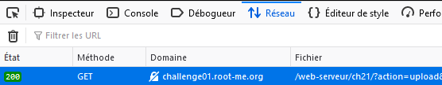
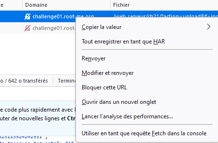
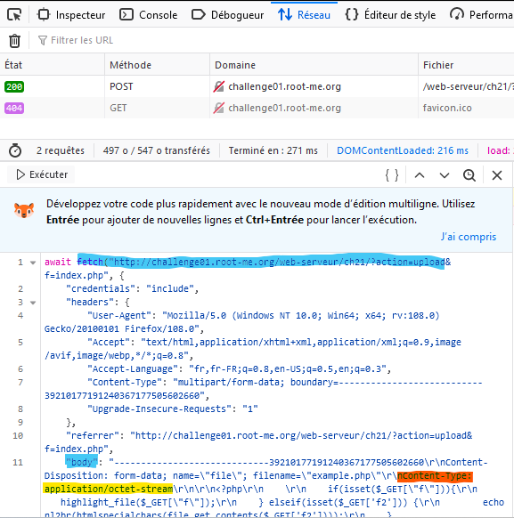
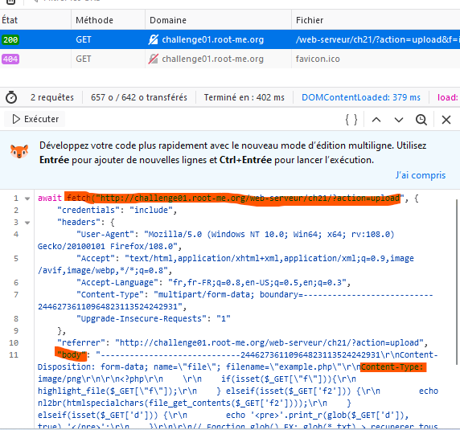
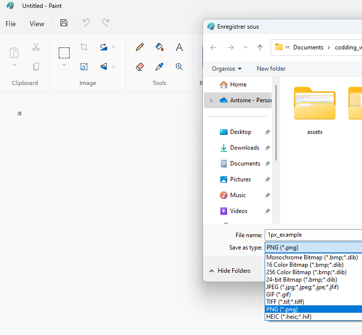
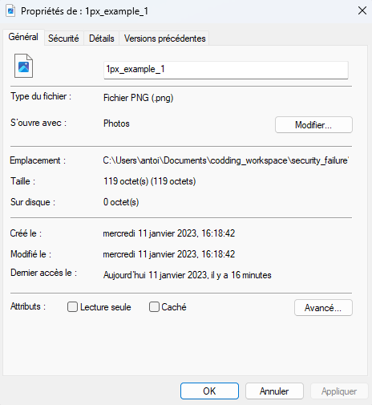
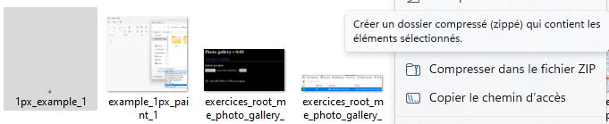
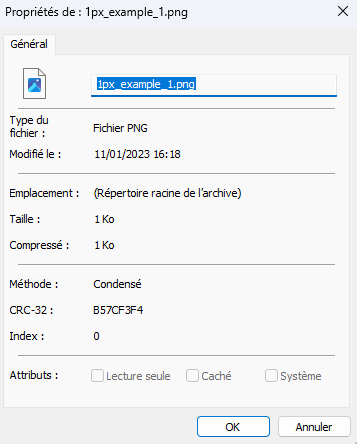
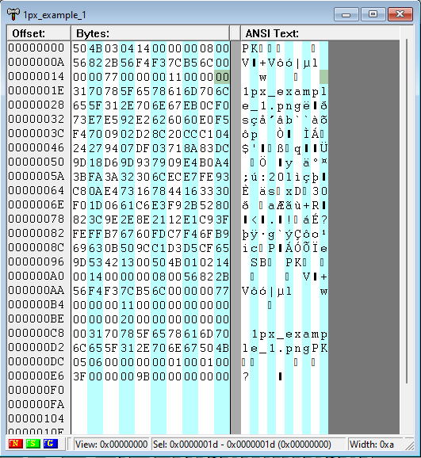

# Type sécurity

Pour détourner les controle de sécurité du typage du fichier voir quelques méthodes.

## nContent-Type

Cette méthode permet de modifier les données cache du fichier importé temporairement dans le navigateur, avec celle attendu sur le serveur.

1. Lorsque vous êtes sur une page avec un formulaire d'import de fichier, importer une première fois ce fichier, qui ne sera pas accepté du fais de son type. Ici fichier php, alors que seul des images sont acceptées. 

2. Lancer l'inspecteur, et dans l'onglet réseau, retrouvé la requête d'import de ce dernier.

3. Clique droit + **Utiliser en tant que requête fetch dans la console.

Vous retrouverais la requet en bas à gauche de la console tel que : 
Location dans le corps de la requete **"body :"** le **nContent-Type: application/octet-stream**

4. Nous allons modifier le nContent-Type  appli... par **image/png**

## File header

### Ressources

- [La boite à physique](https://laboiteaphysique.fr/site2/index.php/programmation-et-logiciels/programmation)

- [Éditeur Hexadécimal En ligne (Recommandé)](https://hexed.it/)

- [Éditeur Hexadécimal Windows (Recommandé hors ligne ou gros projet): A.X.E](https://en.softonic.com/download/advanced-hex-editor-a-x-e)

- [Editeur Hexadécimal Windows : CR-Hexact](http://crteknologies.fr/logiciels/hexact.php)

- [Éditeur Hexadécimal Linux : Bless Hex Editor](https://github.com/afrantzis/bless)

## Explication 

Le script de controlle peut également utiliser des fonctions ou librairies pour controller l'entête du fichier (ses premiers octets)

Pour contourner cette sécurité on peut spécifier une autre entête dans les données du fichier.

Pour pouvoir lire les octets défini dans un fichier on peut utiliser un **éditeur hexadécimal**. C'est un logiciel qui va permettre de visualiser, modifier ou même de créer tout type de fichier.

## Exemple 

### Sur un fichier zip 

On peut remarquer que lorsque l'on génère fichier .zip on peut supprimer ou modifier ses fichiers enfants. 

Par exemple on cré un fichier de 1 pixel avec le logiciel Paint,
il nous propose différent type d'enregistrement. Nous allons l'enregistrer en png, format image globalement accepter dans les upload de fichier.

Qui a pour propriétées : 

on va le convertir en format .zip

Qui a pour propriétées : 

Si on ouvre maintenant ces fichiers avec un éditeur hexadécimal :

- Fichier Zippé

  ██████  ▄▄▄       ██░ ██  ██▓ ██▀███   ▄▄▄     ▄▄▄█████▓ ▒█████  
▒██    ▒ ▒████▄    ▓██░ ██▒▓██▒▓██ ▒ ██▒▒████▄   ▓  ██▒ ▓▒▒██▒  ██▒
░ ▓██▄   ▒██  ▀█▄  ▒██▀▀██░▒██▒▓██ ░▄█ ▒▒██  ▀█▄ ▒ ▓██░ ▒░▒██░  ██▒
  ▒   ██▒░██▄▄▄▄██ ░▓█ ░██ ░██░▒██▀▀█▄  ░██▄▄▄▄██░ ▓██▓ ░ ▒██   ██░
▒██████▒▒ ▓█   ▓██▒░▓█▒░██▓░██░░██▓ ▒██▒ ▓█   ▓██▒ ▒██▒ ░ ░ ████▓▒░
▒ ▒▓▒ ▒ ░ ▒▒   ▓▒█░ ▒ ░░▒░▒░▓  ░ ▒▓ ░▒▓░ ▒▒   ▓▒█░ ▒ ░░   ░ ▒░▒░▒░ 
░ ░▒  ░ ░  ▒   ▒▒ ░ ▒ ░▒░ ░ ▒ ░  ░▒ ░ ▒░  ▒   ▒▒ ░   ░      ░ ▒ ▒░ 
░  ░  ░    ░   ▒    ░  ░░ ░ ▒ ░  ░░   ░   ░   ▒    ░      ░ ░ ░ ▒  
      ░        ░  ░ ░  ░  ░ ░     ░           ░  ░            ░ ░  
                                                                   
                                                                   
                                                                  
                                                                  
