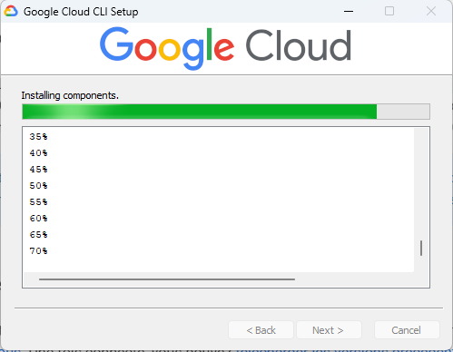
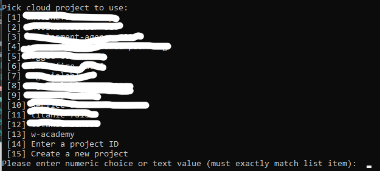
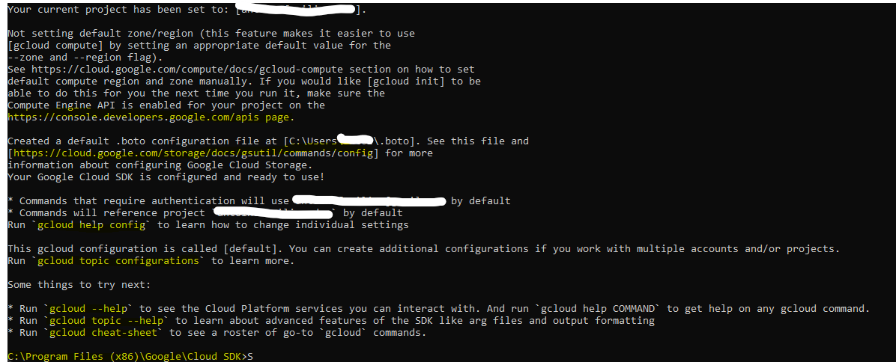

# Google Cloud CLI & Installing and setup 

Google Cloud CLI est la liaison entre votre machine et les serveur de google avec les différents interfaces de commandes cloud.
**RAPPEL** Google SDK / CLI Est entièrement gratuit dès lors l'instanciation de sa session utilisateur Google Cloud avec un compte Google (Recommandation: Utiliser son compte google personnel pour retrouver toutes les modifications apportés et autre, cela est simpa d'avoir un compte Google juste pour le Cloud, mais la perte de ce compte entrainera premièrement la perte de toutes vos données, et puis la relations api entre vos informations, documnets, drive et email via les utilitaires API, ou CLI de google Cloud de votre google Google Personnel sera payant car cela considéré comme la relation entre deux Clouds User différents et requièra la création d'un projet Google Cloud)


1. Commande Windows d'installation (A lancer dans PowerShell en administrateur)
```
(New-Object Net.WebClient).DownloadFile("https://dl.google.com/dl/cloudsdk/channels/rapid/GoogleCloudSDKInstaller.exe", "$env:Temp\GoogleCloudSDKInstaller.exe")

& $env:Temp\GoogleCloudSDKInstaller.exe

```
L'interface d'installation vous demandera la vérification de quelque paramètres,
- première accepter le **screen recorde** cela vous sera utile par la suite
- N'installer que sur votre utilisateur machine pour éviter les hack via les session public ou les utilisateurs générés par des bots
- Accepter l'installation de la beta version afin d'avoir acces et pouvoir tester les dernières amélioration de Google Cli.
- - A savoir Google en 2022/2023 fait énormement d'amélioration, modification et d'ajout sur ses serveur et ajuste toutes les semaines ses commandes CLI


Une fois installer il vous demandera si vous voulez vous identifier avec votre compte google tout de suite, accepter `Y`
Il vous redirera vers une fênetre avec le composant d'authentification Google.
Une fois l'authentification terminée il vous faudra choisir ou créer un nouveau projet.



Une fois sélectionné ou créer un message récapitulatif de settup tel que :


[La page de succès d'authentification](https://cloud.google.com/sdk/auth_success) 